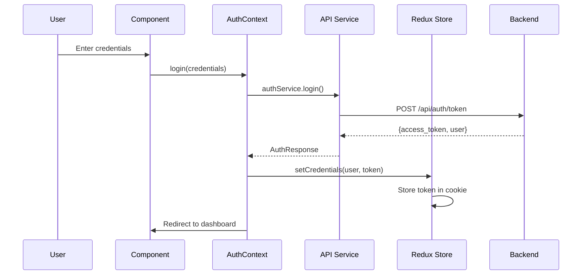

# Authentication System Documentation

This document provides comprehensive documentation for the authentication mechanisms in the Flash Frontend application.

## Table of Contents

- [Authentication System Documentation](#authentication-system-documentation)
  - [Table of Contents](#table-of-contents)
  - [Architecture Overview](#architecture-overview)
  - [Authentication Flow](#authentication-flow)
  - [Components](#components)
    - [Auth Context](#auth-context)
    - [Auth Service](#auth-service)
    - [Redux Store Integration](#redux-store-integration)
    - [Route Protection](#route-protection)
  - [Token Management](#token-management)
  - [Implementation Details](#implementation-details)
    - [Login Process](#login-process)
    - [Registration Process](#registration-process)
    - [Token Validation](#token-validation)
    - [Logout Process](#logout-process)
  - [Security Features](#security-features)
  - [Error Handling](#error-handling)
  - [Usage Examples](#usage-examples)

## Architecture Overview

The Flash Frontend uses a hybrid authentication system that combines:

1. **JWT Tokens**: Stored in HTTP-only cookies with 15-minute expiration
2. **Redux State Management**: For user data and authentication state
3. **React Context**: For easy access to authentication functions
4. **Route Protection**: Automatic redirects and access control

```
┌─────────────────┐    ┌─────────────────┐    ┌─────────────────┐
│   Auth Context  │────│  Redux Store    │────│  Cookie Storage │
│   (React)       │    │  (User Data)    │    │  (JWT Token)    │
└─────────────────┘    └─────────────────┘    └─────────────────┘
         │                       │                       │
         └───────────────────────┼───────────────────────┘
                                 │
                    ┌─────────────────┐
                    │  Route Guards   │
                    │  & Protection   │
                    └─────────────────┘
```

## Authentication Flow

### Initial Authentication Check

1. **App Initialization**:

   - Check for JWT token in cookies
   - If token exists, validate with backend
   - If valid, fetch user data and update Redux store
   - If invalid, clear token and redirect to login

2. **Periodic Validation**:
   - Every 5 minutes, validate token with backend
   - If validation fails, auto-logout user

### Login Flow



## Components

### Auth Context

**Location**: `context/auth.tsx`

The Auth Context provides authentication state and functions to all components:

```typescript
interface AuthContextType {
  user: any | null;
  isLoading: boolean;
  isAuthenticated: boolean;
  isAdmin: boolean;
  login: (credentials: LoginCredentials) => Promise<AuthResponse>;
  register: (data: RegisterData) => Promise<AuthResponse>;
  logout: () => void;
}
```

**Key Features**:

- Integrates with Redux for state management
- Handles automatic token validation
- Manages redirect logic after authentication
- Provides periodic token refresh

### Auth Service

**Location**: `lib/auth-service.ts`

Low-level authentication API calls:

```typescript
export const authService = {
  async login(credentials: LoginCredentials): Promise<AuthResponse>
  async register(data: RegisterData): Promise<AuthResponse>
  async getUserDetails(token?: string): Promise<UserDetails>
}
```

**Features**:

- Direct API communication
- Token-based authentication
- User data fetching
- Error handling and validation

### Redux Store Integration

**Location**: `lib/store/slices/auth.ts`

Redux slice for authentication state management:

```typescript
interface AuthState {
  user: User | null;
  accessToken: string | null;
  isAuthenticated: boolean;
  isLoading: boolean;
}
```

**Actions**:

- `setCredentials`: Store user data and token
- `logout`: Clear authentication state
- `setLoading`: Control loading state
- `updateUser`: Update user information
- `initializeFromCookie`: Initialize from stored token

### Route Protection

**Location**: `hooks/use-route-protection.tsx`

Comprehensive route protection system:

```typescript
interface UseRouteProtectionOptions {
  requireAuth?: boolean;
  requireAdmin?: boolean;
  redirectTo?: string;
  skipRedirect?: boolean;
}
```

**Features**:

- Automatic redirects for unauthenticated users
- Admin-only route protection
- Remember intended destination
- Token validation on protected routes

## Token Management

### Cookie-Based Storage

**Implementation**: `lib/axios.ts`

```typescript
// Set token in HTTP-only cookie
export const setAccessTokenCookie = (token: string): void => {
  const maxAge = 15 * 60; // 15 minutes
  document.cookie = `access_token=${token}; max-age=${maxAge}; path=/; secure; samesite=strict`;
};

// Get token from cookie
export const getAccessTokenFromCookie = (): string | null => {
  return getCookie("access_token");
};

// Remove token cookie
export const removeAccessTokenCookie = (): void => {
  document.cookie = "access_token=; max-age=0; path=/";
};
```

### Automatic Token Injection

Axios interceptor automatically adds Authorization header:

```typescript
axiosInstance.interceptors.request.use((config) => {
  const token = getTokenFromStorage();
  if (token) {
    config.headers.Authorization = `Bearer ${token}`;
  }
  return config;
});
```

### Token Validation

```typescript
export const validateToken = async (): Promise<boolean> => {
  const token = getAccessTokenFromCookie();
  if (!token) return false;

  try {
    await axiosInstance.get("/api/auth/me");
    return true;
  } catch (error) {
    if (error.response?.status === 401) {
      removeAccessTokenCookie();
      return false;
    }
    return true; // Assume valid for other errors
  }
};
```

## Implementation Details

### Login Process

1. **User Input Validation**: Form validation using Zod schema
2. **API Call**: Send credentials to backend
3. **Token Storage**: Store JWT token in HTTP-only cookie
4. **User Data**: Store user data in Redux store
5. **Redirect**: Navigate to intended page or dashboard

```typescript
const login = async (credentials: LoginCredentials): Promise<AuthResponse> => {
  const response = await ApiService.login(credentials);
  dispatch(
    setCredentials({
      user: response.user,
      accessToken: response.access_token,
    })
  );

  const redirectParam = searchParams?.get("redirectTo");
  const target =
    (redirectParam && redirectParam.startsWith("/") && redirectParam) ||
    (response.user?.role === "admin" ? "/admin" : "/dashboard");
  router.replace(target);

  return response;
};
```

### Registration Process

Similar to login but includes additional user data validation:

```typescript
const register = async (data: RegisterData): Promise<AuthResponse> => {
  const response = await ApiService.register(data);
  dispatch(
    setCredentials({
      user: response.user,
      accessToken: response.access_token,
    })
  );

  // Redirect logic similar to login
  return response;
};
```

### Token Validation

Periodic validation every 5 minutes:

```typescript
useEffect(() => {
  if (!isAuthenticated) return;

  const validateTokenPeriodically = async () => {
    const isValid = await validateToken();
    if (!isValid) {
      dispatch(logoutAction());
      router.push("/login");
    }
  };

  validateTokenPeriodically();
  const interval = setInterval(validateTokenPeriodically, 5 * 60 * 1000);
  return () => clearInterval(interval);
}, [isAuthenticated, dispatch, router]);
```

### Logout Process

1. **Clear Redux State**: Remove user data and authentication state
2. **Remove Token**: Delete HTTP-only cookie
3. **Redirect**: Navigate to login page

```typescript
const logout = () => {
  dispatch(logoutAction());
  router.push("/login");
};
```

## Security Features

### HTTP-Only Cookies

- Tokens stored in HTTP-only cookies to prevent XSS attacks
- Secure flag for HTTPS environments
- SameSite=Strict for CSRF protection

### Short Token Expiration

- 15-minute token expiration to limit exposure
- Automatic token validation and refresh

### Route Protection

- Comprehensive route guards
- Admin-only sections
- Automatic redirects for unauthorized access

### Error Handling

- 401 errors trigger automatic logout
- Token validation on sensitive operations
- Graceful degradation for network issues

## Error Handling

### Authentication Errors

```typescript
// 401 Unauthorized - Automatic logout
axiosInstance.interceptors.response.use(
  (response) => response,
  async (error) => {
    if (error.response?.status === 401) {
      removeAccessTokenCookie();
      // Trigger logout through Redux
      window.location.href = "/login";
    }
    return Promise.reject(error);
  }
);
```

### Validation Errors

```typescript
// Form validation with Zod
const loginSchema = z.object({
  username: z.string().min(1, "Username is required"),
  password: z.string().min(1, "Password is required"),
});
```

### Network Errors

```typescript
try {
  const response = await authService.login(credentials);
  // Handle success
} catch (error) {
  if (error.response?.status === 401) {
    setError("Invalid username or password");
  } else {
    setError("Login failed. Please try again.");
  }
}
```

## Usage Examples

### Using Auth Context

```typescript
import { useAuth } from "@/context/auth";

function MyComponent() {
  const { user, isAuthenticated, login, logout } = useAuth();

  if (!isAuthenticated) {
    return <LoginForm onLogin={login} />;
  }

  return (
    <div>
      <p>Welcome, {user.name}!</p>
      <button onClick={logout}>Logout</button>
    </div>
  );
}
```

### Route Protection

```typescript
import { useRouteProtection } from "@/hooks/use-route-protection";

function AdminPanel() {
  const { isLoading, canAccess } = useRouteProtection({
    requireAuth: true,
    requireAdmin: true,
  });

  if (isLoading) return <Loading />;
  if (!canAccess) return null; // Will redirect automatically

  return <AdminContent />;
}
```

### Protected Route Component

```typescript
import { ProtectedRoute } from "@/hooks/use-route-protection";

function App() {
  return (
    <ProtectedRoute requireAuth={true} requireAdmin={true}>
      <AdminDashboard />
    </ProtectedRoute>
  );
}
```

### API Calls with Authentication

```typescript
import { ApiService } from "@/lib/api-service";

// Automatically includes Authorization header
const userData = await ApiService.getCurrentUser();
const backtests = await ApiService.getUserBacktests();
```

This authentication system provides a robust, secure, and user-friendly authentication experience with automatic token management, comprehensive route protection, and seamless integration with the application's state management system.
